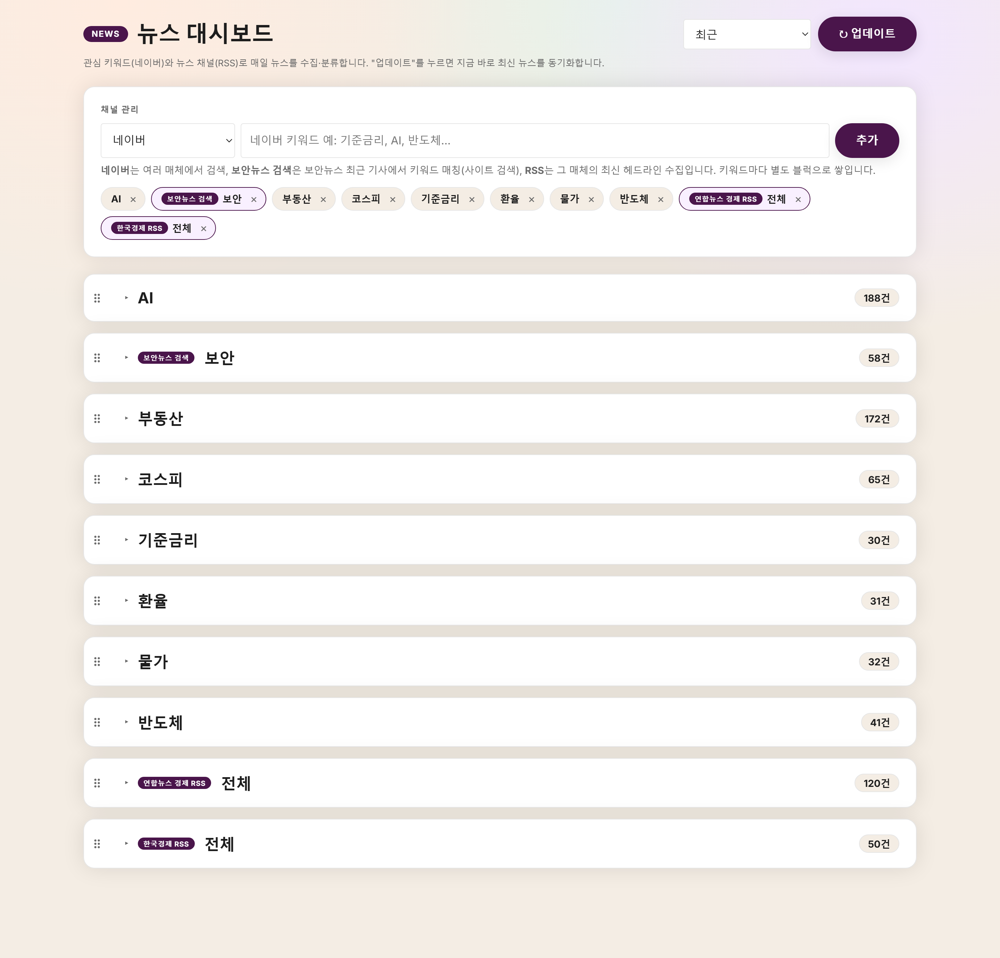

# 뉴스 대시보드

관심 **키워드(네이버)**, **보안뉴스 검색**, **뉴스 채널(RSS)** 로 뉴스를 수집·분류하고,
**AI 스터디**로 뉴스를 학습으로 잇는 대시보드입니다.

## 화면 예시



> `start.bat`(Windows) 또는 `python run.py` 실행 시 열리는 첫 화면. 채널(키워드/검색/RSS)별 블럭이 처음엔 접힌 상태로 건수와 함께 표시되며, 블럭을 펼치면 뉴스 카드가 나타납니다.

- 🆕 기본 화면은 **"최근" 모아보기** — 최근 며칠 기사를 한 화면에 최신순으로 표시
- 📌 채널(키워드/검색/RSS)별로 뉴스를 블럭으로 분류
- ➕ 대시보드에서 채널 추가 / 삭제
- ↻ **"업데이트" 버튼**으로 지금 즉시 최신 뉴스 동기화
- ⏰ 매일 지정 시각에 자동 수집(백엔드 실행 중일 때)
- 🤖 **AI 뉴스 스터디** — 카드를 클릭하면 요약·용어풀이·맥락·투자관점 해설 + 자유 질문(아래 참고)
- 📓 **학습 노트 & 용어장** — 배운 내용을 저장·축적(마크다운·이미지 지원)

---

## 빠른 시작 (원클릭)

의존성 설치 → 프론트 빌드 → 서버 실행 → 브라우저 열기까지 자동으로 처리합니다.
한 포트(**http://localhost:8000**)에서 웹과 API가 함께 뜹니다.

- **Windows**: `start.bat` 더블클릭
- **macOS / Linux**: 터미널에서 `./start.sh` (또는 `python3 run.py`)
- **공통**: `python run.py`

**요구사항**: Python 3.10+, Node.js 18+(프론트 빌드용).
네이버 API 키는 **선택** — 없어도 앱은 뜨고 **RSS·보안뉴스 검색 채널은 정상 동작**합니다.
(네이버 키워드 검색까지 쓰려면 아래 "네이버 API 키" 참고.)

---

## 채널 종류 & 차이점

이 앱의 핵심은 **하나의 "채널" 모델**입니다. 세 종류의 수집원이 모두 동일한 구조로
동작하며, 각 채널이 대시보드의 한 블럭이 됩니다.

| 채널 | 무엇을 수집하나 | 출처 범위 | 검색 방식 | 네이버 키 필요 |
|---|---|---|---|---|
| **키워드(네이버)** | 입력 키워드로 네이버 검색 API에서 최신순 수집 | 여러 매체(제한 없음) | 네이버 검색(제목·요약) | ✅ 필요 |
| **보안뉴스 검색** | 보안뉴스 최근 기사를 **본문까지** 훑어 키워드 매칭 | 보안뉴스 한 곳으로 한정 | 사이트 크롤링 + 본문 키워드 매칭 | ❌ 불필요 |
| **뉴스 채널(RSS)** | 특정 언론사 RSS 피드의 최신 헤드라인 | 지정한 피드 한 곳 | 검색 없음(최신 목록 그대로) | ❌ 불필요 |

- **키워드(네이버)** — 폭넓게 여러 언론사를 훑고 싶을 때. 단, 언론사 지정은 불가.
- **보안뉴스 검색** — 특정 매체(보안뉴스)에서 **키워드로 검색**하고 싶을 때. RSS는
  헤드라인 몇 건만 주므로, 본문까지 뒤져 매칭하는 이 채널이 검색에 적합.
- **뉴스 채널(RSS)** — 특정 언론사의 **최신 기사를 통째로** 받아보고 싶을 때.
  "채널 관리"의 프리셋(예: 보안뉴스 RSS)으로 한 번에 추가 가능(검색어 필터도 선택 가능).

---

## 🤖 AI 뉴스 스터디 & 학습 노트

뉴스를 "읽고 끝"이 아니라 **학습으로 잇기 위한 기능**입니다. 뉴스 카드를 클릭하면
AI 스터디 패널이 열립니다.

### AI 스터디 (기사 카드 클릭)

- **핵심 요약** — 무엇을 / 왜 / 그래서 3줄
- **용어 풀이** — 어려운 용어를 쉬운 설명 + 예시로 (바로 **용어장에 저장** 가능)
- **맥락·연결** — 왜 지금 벌어졌나 / 무엇과 연결되나 / 앞으로 볼 것
- **나에게의 의미** — 이 분야 지식 / 커리어 / (경제·산업 뉴스면) 투자 관점
- **질문하기** — 기사에 대해 자유롭게 물어보고, 답변도 노트에 저장

> 기사 분야(경제·AI·보안 등)를 **자동으로 파악**해 그에 맞게 설명하고,
> **원문 본문까지 읽어**(trafilatura) 해설 품질을 높입니다.

### 하이브리드 — API 키 없이도 사용

- OpenAI 키가 있으면 **"AI로 전체 해설"** 버튼으로 자동 생성(결과는 캐시되어 재열람은 무료).
- 키가 없으면 **"프롬프트 복사"** → 이미 쓰는 **ChatGPT/Claude 챗에 붙여넣어 무료**로 사용.

### 학습 노트 & 용어장 (상단 "학습 노트" 탭)

- **용어장** — AI가 풀어준 용어나 직접 입력한 용어를 **검색 가능한 카드**로 축적
- **스터디 노트** — 기사별 메모·해설을 저장·누적(접이식). **마크다운(제목·목록·굵게·링크)과
  이미지(URL)** 를 지원하고, 편집 중 **미리보기**로 확인할 수 있습니다.

> **AI 키는 선택**입니다. `backend/.env` 에 `OPENAI_API_KEY` 를 넣으면 자동 생성이 켜지고,
> 없어도 "프롬프트 복사" 방식으로 모든 기능을 쓸 수 있습니다. 모델은 `STUDY_MODEL`
> (기본 `gpt-4o-mini`, 권장 `gpt-5-mini`).

## 기술 스택

- **백엔드**: FastAPI + SQLite + APScheduler
- **프론트**: React + Vite (빌드 결과를 FastAPI 가 정적 서빙)
- **뉴스**: 네이버 검색 API + 보안뉴스 스크래핑 + RSS(feedparser)
- **AI 스터디**: OpenAI API(선택) + 원문 본문 추출(trafilatura)

---

## 네이버 API 키 (선택)

네이버 키워드 채널까지 쓰려면:

1. https://developers.naver.com 접속 → 로그인
2. **Application → 애플리케이션 등록**, 사용 API에서 **"검색"** 선택
3. 발급된 **Client ID / Client Secret** 을 `backend/.env` 에 입력
   (`run.py` 가 없으면 `backend/.env.example` 을 자동 복사해 둡니다):

```
NAVER_CLIENT_ID=발급받은_아이디
NAVER_CLIENT_SECRET=발급받은_시크릿
DAILY_FETCH_TIME=08:00
```

---

## 개발 모드 (프론트 핫리로드)

프론트를 수정하며 개발할 때는 백엔드·프론트를 따로 띄웁니다.

```bash
# 터미널 1 — 백엔드
cd backend
pip install -r requirements.txt
uvicorn main:app --reload          # http://localhost:8000

# 터미널 2 — 프론트(Vite 개발 서버)
cd frontend
npm install
npm run dev                        # http://localhost:5173 (/api 는 :8000 으로 프록시)
```

> 참고: `frontend/dist` 가 있으면 백엔드가 그걸 정적 서빙합니다(단일 서버). 개발 중
> 최신 프론트를 보려면 `npm run dev`(5173) 를 쓰거나 `npm run build` 로 dist 를 갱신하세요.

---

## 사용법

1. **채널 관리**에서 출처(네이버 / 보안뉴스 검색 / RSS)를 고르고 키워드를 추가하면
   즉시 수집됩니다.
2. 기본 화면은 **"최근"** — 최근 며칠 기사가 채널별 블럭에 최신순으로 쌓입니다.
3. **↻ 업데이트** 버튼으로 전체 채널을 다시 수집합니다.
4. 우측 상단 드롭다운에서 **특정 발행일**을 골라 그날 기사만 볼 수도 있습니다.
5. 뉴스 **카드를 클릭**하면 **AI 스터디** 패널이 열립니다 — 요약·용어·맥락·투자관점 해설과
   질문하기, 그리고 용어장·노트 저장을 할 수 있습니다.
6. 상단 **"학습 노트"** 탭에서 저장한 용어장과 스터디 노트를 모아봅니다.

## 주요 API

| 메서드 | 경로 | 설명 |
|---|---|---|
| GET | `/api/keywords` | 채널 목록(네이버/보안뉴스/RSS) |
| POST | `/api/keywords` | 채널 추가. 네이버: `{"keyword":"AI"}` · 보안뉴스 검색: `{"keyword":"취약점","kind":"boannews"}` · RSS: `{"keyword":"보안뉴스","kind":"rss","feed_url":"https://..."}` |
| DELETE | `/api/keywords/{id}` | 채널 삭제 |
| GET | `/api/rss/presets` | 한 번에 추가 가능한 RSS 프리셋 |
| GET | `/api/dashboard` | **최근** 모아보기(기본). `?date=YYYY-MM-DD` 로 특정 발행일만 |
| GET | `/api/dates` | 뉴스가 있는 발행일 목록 |
| POST | `/api/update` | 지금 즉시 전체 재수집. 네이버 키가 없어도 RSS·보안뉴스는 수집됨 |
| GET·POST | `/api/articles/{id}/study` | 기사 AI 해설 조회 / 생성(4섹션, 캐시) |
| GET | `/api/articles/{id}/prompt` | 복사용 프롬프트(키 없이 쓰는 무료 경로) |
| POST | `/api/articles/{id}/ask` | 기사에 대한 자유 질문(Q&A) |
| GET·POST·DELETE | `/api/glossary` | 용어장 조회 / 추가 / 삭제 |
| GET·PUT | `/api/notes`, `/api/notes/{id}` | 스터디 노트 목록 / 저장 |

환경변수(`backend/.env`): `NAVER_CLIENT_ID/SECRET`, `DAILY_FETCH_TIME`(기본 08:00),
`RECENT_DAYS`("최근" 윈도우 일수, 기본 7), `BOANNEWS_PAGES`(보안뉴스 검색 페이지 수, 기본 3),
`OPENAI_API_KEY`(AI 스터디, 선택), `STUDY_MODEL`(기본 `gpt-4o-mini`, 권장 `gpt-5-mini`).
